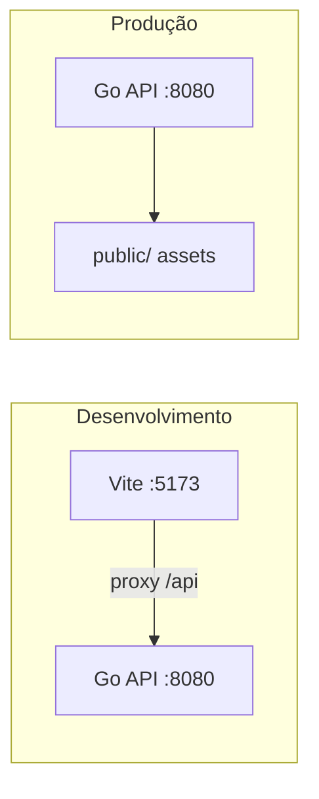

# Go Quick-Start Template

Template base para aplicações Go com PostgreSQL, sqlc, migrations customizadas, HTTP server e frontend Vite servido pela própria API.

## Setup inicial

```bash
cp .env.example .env
docker compose up -d
go mod tidy
go install github.com/sqlc-dev/sqlc/cmd/sqlc@latest
sqlc generate
go run cmd/migrations/run.go up
cd frontend && npm install && npm run build && cd ..
go run cmd/server/api.go
```

Acesse http://localhost:8080 — a API serve o frontend buildado em `public/`.

## Desenvolvimento com frontend

```bash
# Terminal 1 — API Go
air

# Terminal 2 — Vite dev server (proxy /api → :8080)
cd frontend && npm install && npm run dev
```

Acesse http://localhost:5173 — o Vite faz proxy das rotas `/api` e `/health` para a API Go.

## Onde alterar o nome da aplicação

| Arquivo | O que mudar |
|---------|-------------|
| `.env` | `APP_NAME`, `POSTGRES_*`, `DB_URL` |
| `go.mod` | `module meu-app` |
| Imports em `cmd/` e `internal/` | path do módulo (`go-config/...` → `meu-app/...`) |
| `docker-compose.yaml` | usa `${APP_NAME}` — basta mudar no `.env` |
| `frontend/index.html` | `<title>` |
| `frontend/src/main.ts` | título exibido na página |
| Pasta do projeto | nome da pasta define prefixo dos volumes/rede Docker |

## Comandos úteis

```bash
# Banco de dados
docker compose up -d
docker compose down -v

# Migrations
go run cmd/migrations/run.go up
go run cmd/migrations/run.go reset

# sqlc (após alterar schema ou queries)
sqlc generate

# Dependências
go mod tidy

# Frontend
cd frontend && npm run build   # gera ../public/
cd frontend && npm run dev     # dev server :5173

# Servidor
go run cmd/server/api.go

# Hot reload (air)
air
```

## Endpoints de exemplo

```bash
# Health check
curl http://localhost:8080/health

# Criar usuário
curl -X POST http://localhost:8080/api/users \
  -H 'Content-Type: application/json' \
  -d '{"nome":"Ana","email":"ana@example.com","password":"123"}'

# Buscar usuário
curl http://localhost:8080/api/users/1

# JWT (gerar token de exemplo)
go run cmd/tools/jwt/main.go

# JWT (validar token)
curl http://localhost:8080/api/example/jwt \
  -H "Authorization: Bearer SEU_TOKEN_AQUI"
```

## Frontend + API (como funciona)



- **Dev:** Vite roda em `:5173` e faz proxy de `/api` para a API Go
- **Prod:** `npm run build` gera arquivos em `public/`; a API Go serve os assets estáticos com fallback SPA (`internal/server/spa.go`)
- Rotas da API ficam sob `/api/*`; `/health` permanece na raiz para health checks

## Estrutura do projeto

```
cmd/
  server/api.go          # entrypoint HTTP
  migrations/run.go      # runner de migrations
  tools/jwt/main.go      # gera token JWT de exemplo
frontend/                # Vite + TypeScript (dev)
public/                  # build do frontend (gitignored)
internal/
  db/                    # código gerado pelo sqlc + conexão
  handler/               # handlers HTTP
  middleware/            # timing, JWT exemplo
  repository/            # camada repository
  routes/                # registro central de rotas
  server/                # SPA handler (serve public/)
db/
  schema/                # migrations SQL
  queries/               # queries sqlc
```

## Bibliotecas incluídas

| Biblioteca | Uso no template |
|------------|-----------------|
| `joho/godotenv` | carrega `.env` no server e migrations |
| `jackc/pgx/v5` | driver PostgreSQL via `database/sql` |
| `golang-jwt/jwt/v5` | exemplo de validação JWT em `internal/middleware/jwt.go` |
| `log/slog` | log de tempo de execução das rotas (stdlib) |
| Vite | frontend em `frontend/`, build para `public/` |

## Instalação do sqlc

```bash
go install github.com/sqlc-dev/sqlc/cmd/sqlc@latest
```

## Hot reload com Air

```bash
go install github.com/air-verse/air@latest
air
```

O Air observa mudanças em arquivos `.go` (exceto código gerado pelo sqlc) e reinicia o server automaticamente. Configuração em [`.air.toml`](.air.toml).

Certifique-se de que `$GOPATH/bin` ou `$HOME/go/bin` está no seu `PATH`.
